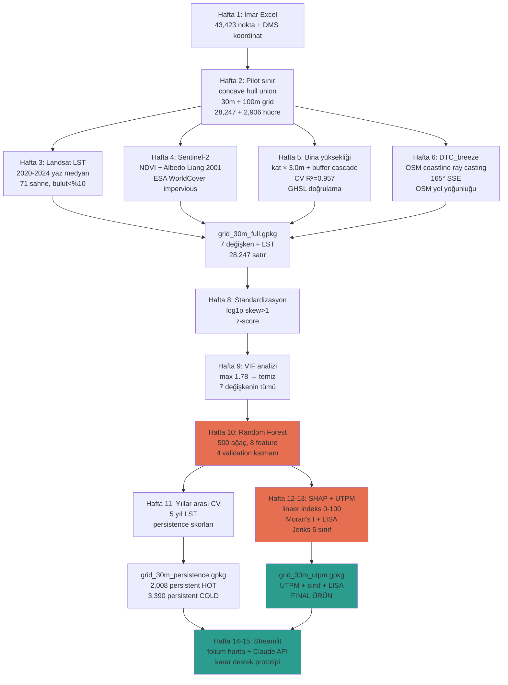

# Yöntem Akışı

## 16 Haftalık Pipeline



## Veri akış zinciri

| Hafta | Girdi | İşlem | Çıktı |
|---|---|---|---|
| 1 | Konyaaltı imar Excel | DMS koord parse, mahalle filtre | `imar_pilot_*.gpkg` |
| 2 | Pilot noktalar | Concave hull union + 30/100m grid | `grid_30m.gpkg`, `grid_100m.gpkg`, `pilot_boundary.gpkg` |
| 3 | GEE Landsat 8/9 C2L2 | Bulut maskesi + ST_B10 → Celsius + median | `grid_30m_lst.gpkg` |
| 4 | GEE S2 + WorldCover | NDVI/Albedo/Impervious zonal | `grid_30m_variables.gpkg` |
| 5 | İmar kat verisi + GHSL | Buffer cascade imputation + 5-fold CV | `grid_30m_building.gpkg` |
| 6 | OSM coastline + roads | Ray casting + overlay | `grid_30m_full.gpkg` |
| 8 | full GPKG | log1p + z-score | `grid_30m_standardized.gpkg` |
| 9 | standardized | VIF analizi | `grid_30m_modeling.gpkg` |
| 10 | modeling | RF + 4 validation | `grid_30m_predictions.gpkg`, `rf_model.pkl` |
| 11 | RF model + 5 yıl LST | Cross-year prediction | `grid_30m_persistence.gpkg` |
| 12-13 | model + features | SHAP + UTPM + Moran + Jenks | `grid_30m_utpm.gpkg` |
| 14-15 | UTPM + persistence | Streamlit + folium + Claude | `streamlit_app/` |

## Yazılım katmanları

```
src/
├── config.py              # Tüm sabitler (CRS, mahalleler, RF parametre)
├── coord_utils.py         # DMS parser
├── grid_utils.py          # Pilot sınır + grid kurulum
├── building_height.py     # Imputation + grid agregasyon
├── variables.py           # Zonal stats
├── dtc_breeze.py          # Ray casting + OSM
├── gee_utils.py           # GEE auth + Landsat/S2/WorldCover/GHSL
├── standardization.py     # Skewness + z-score
├── feature_selection.py   # VIF + iterative drop
├── modeling.py            # RF + 4 validation
└── utpm.py                # SHAP + indeks + Moran + Jenks
```

## Önemli yöntem detayları

### Buffer cascade imputation (Hafta 5)
- 5,787 / 18,575 noktada kat verisi eksik
- Her eksik nokta için 10 m → 100 m → 500 m → 1000 m halkalarında en az 3 komşu olan en küçük yarıçapta ortalama yükseklik atanır
- 5-fold CV: RMSE = 0.81 m, R² = 0.957

### DTC_breeze (Hafta 6)
- Hakim rüzgar 165° SSE (literatür/iklim atlas)
- Her grid hücre centroidinden 165° yönünde 20 km'lik ışın
- OSM coastline ile ilk kesişim mesafesi = DTC_breeze
- 1,066 hücre saturated (kıyının deniz tarafında, ışın denize gidiyor)

### Random Forest (Hafta 10)
- `RandomForestRegressor(n_estimators=500, random_state=42, n_jobs=-1)`
- 8 feature (7 raw + `is_dtc_saturated` binary flag)
- NaN handling: `fillna(0)` (semantic — bina yok = 0 m yükseklik)

### Validation katmanları
1. **Random 5-fold KFold** — `shuffle=True, random_state=42`
2. **Spatial Block 5-fold** — 500 m karelere böl, blokları rastgele fold'a ata
3. **Mahalle hold-out** — `["ALTINKUM", "HURMA", "GÜRSU"]` tamamen test
4. **Permutation null** — target shuffled, 50 perm × 3-fold CV

### SHAP TreeExplainer (Hafta 12)
- `feature_perturbation="tree_path_dependent"`, `approximate=True`
- 1000 sample (28K full hesap saatlerce sürer)
- Global importance = `mean(|shap_values|)` → normalize edilmiş ağırlık

### UTPM indeks
- `UTPM_raw = Σ_i sign_i × w_i × z_i` (i = 7 feature)
- `sign_flips = {ndvi_z: -1}` (yüksek NDVI = serin → çevir)
- `UTPM_score = (raw - min) / (max - min) × 100` (0-100)

### Moran's I + LISA
- K=8 en yakın komşu, row-standardize W matrisi
- `esda.Moran` global, `Moran_Local` LISA
- LISA cluster: HH/LL/HL/LH eğer p_sim < 0.05, yoksa NS

### Jenks Natural Breaks
- `mapclassify.NaturalBreaks(values, k=5)`
- Sınıf etiketleri: Çok serin / Serin / Orta / Sıcak / Çok sıcak

## Tekrar üretilebilirlik

Tüm rasgele seedler `RANDOM_STATE = 42`. Tüm CRS `EPSG:32636` (UTM 36N). Tüm yıllar 2020-2024 yaz Haziran-Ağustos.

```bash
git clone https://github.com/ercntrgt/asliutpm.git
cd asliutpm
conda env create -f environment.yml
conda activate utpm
pip install -e .

# data/raw/konyaalti_imar_tum_veri.xlsx dosyasını yerleştir
# GEE_PROJECT env variable set et
# Sonra notebook'ları sırayla çalıştır:
jupyter lab notebooks/00_data_overview.ipynb
# ... 01, 02, ..., 10
```
